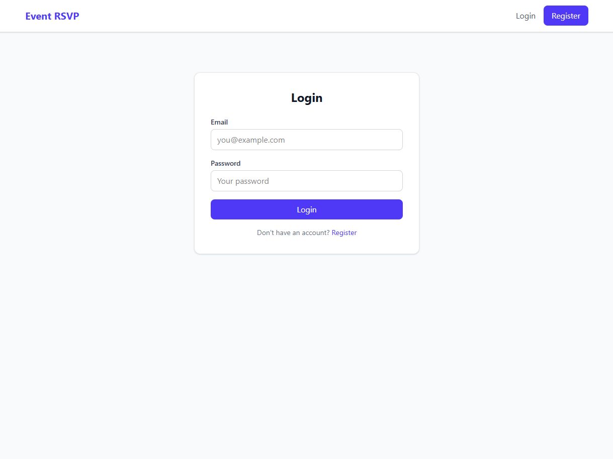
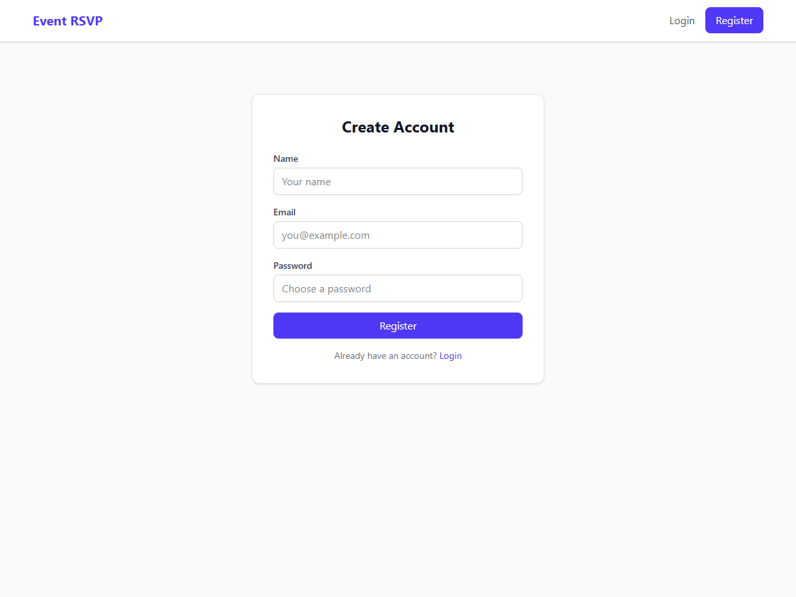
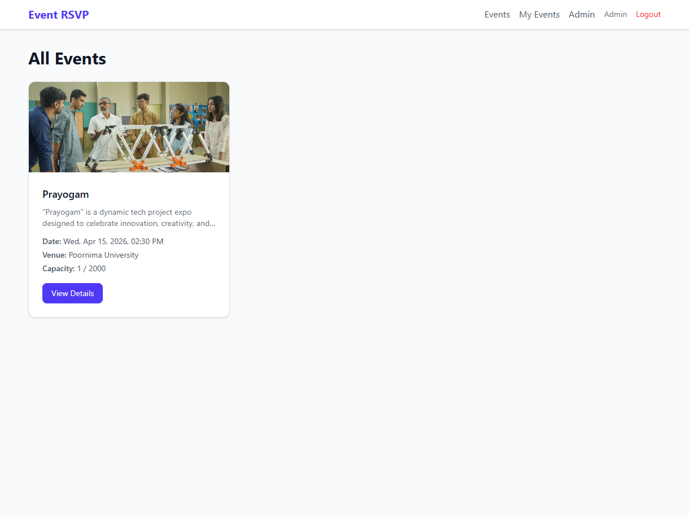
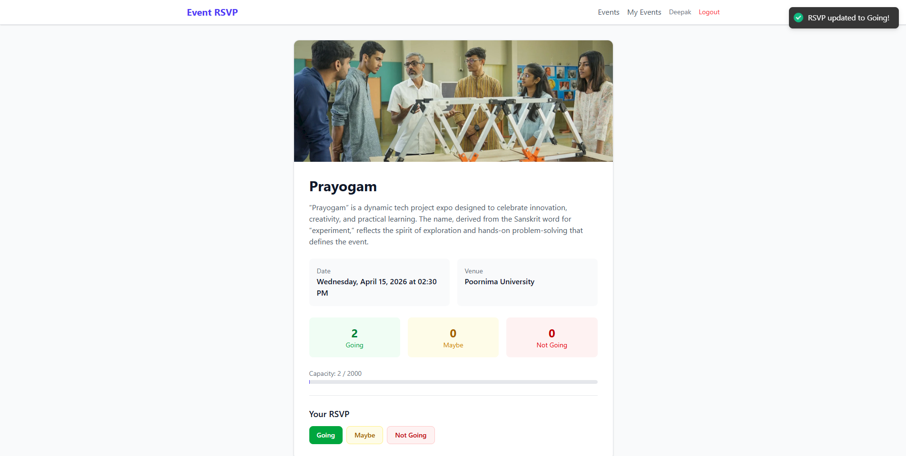
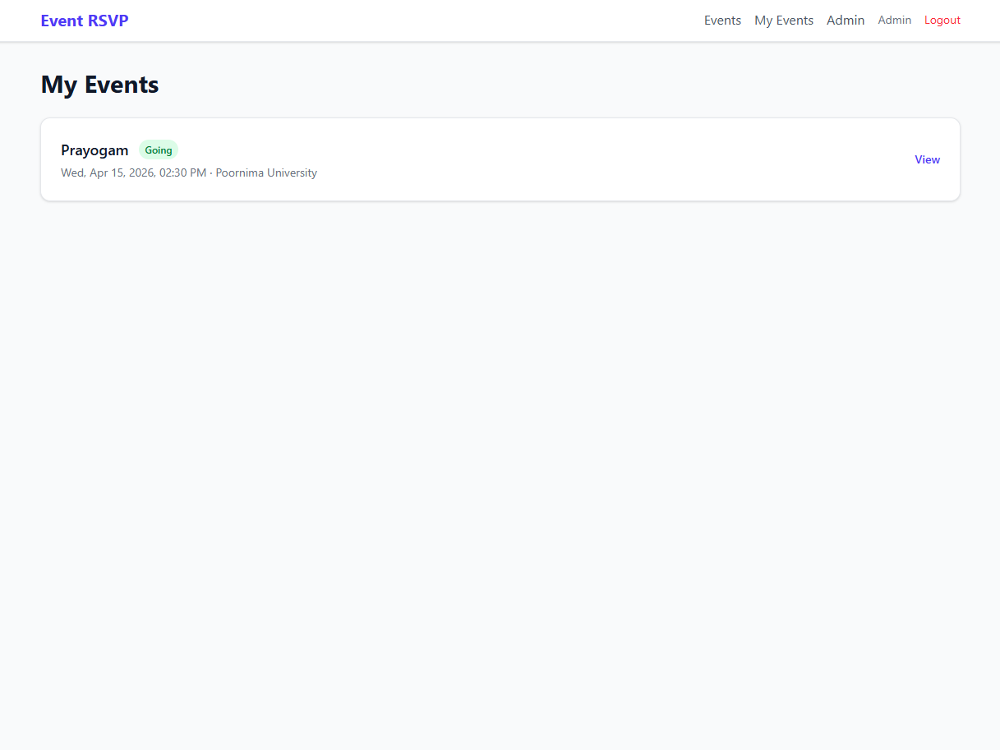
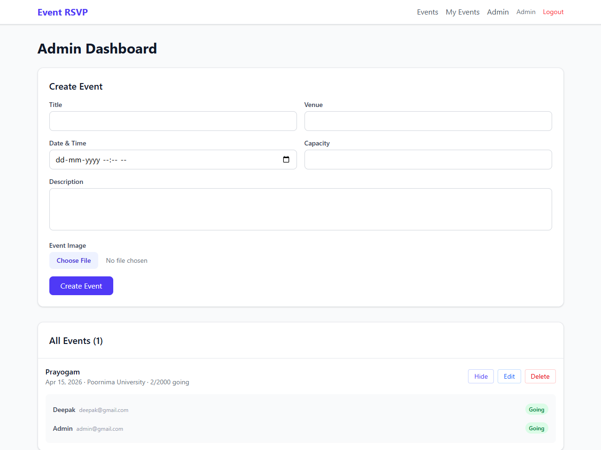

# Event Management Application

A full-stack web application for creating, managing, and RSVPing to events with real-time updates and image support.

## 📋 Project Overview

This Event Management Application provides a comprehensive platform for users to discover events, manage their RSVPs, and for administrators to create and manage events with image uploads. The application features real-time updates using Socket.IO and a modern, responsive UI built with React and Tailwind CSS.

## 🏗️ Architecture

### Technology Stack

**Frontend:**
- **React 19.2.4** - Modern React with hooks and functional components
- **React Router 7.14.0** - Client-side routing
- **Tailwind CSS 4.2.2** - Utility-first CSS framework
- **Axios 1.14.0** - HTTP client for API calls
- **Socket.IO Client 4.8.3** - Real-time communication
- **Vite 8.0.4** - Build tool and dev server

**Backend:**
- **Node.js** - JavaScript runtime
- **Express 5.2.1** - Web framework
- **MongoDB with Mongoose 9.4.1** - Database and ODM
- **Socket.IO 4.8.3** - Real-time WebSocket server
- **JWT (JSON Web Tokens)** - Authentication
- **bcryptjs 3.0.3** - Password hashing
- **Multer 2.1.1** - File upload handling
- **CORS 2.8.6** - Cross-origin resource sharing

### Deployment Architecture

**Single Service Deployment (Production)**
- The React frontend is built to static files and served by the Express server
- All requests are handled by a single Node.js process on port 5000
- API routes are served from `/api/*` endpoints
- All other routes serve the React SPA with proper fallback handling
- Socket.IO works seamlessly with the unified service

**Development Mode (Separate Services)**
- Frontend runs on Vite dev server (port 5173)
- Backend runs on Express server (port 5000)
- Proxy configuration handles API communication during development

### Project Structure

```
event-app/
├── client/                 # React frontend application
│   ├── public/            # Static assets
│   │   ├── favicon.svg
│   │   └── icons.svg
│   ├── src/
│   │   ├── assets/        # Project assets
│   │   ├── components/    # Reusable UI components
│   │   │   ├── AdminRoute.jsx
│   │   │   ├── EventCard.jsx
│   │   │   ├── Navbar.jsx
│   │   │   ├── ProtectedRoute.jsx
│   │   │   └── RsvpButton.jsx
│   │   ├── context/       # React context providers
│   │   ├── pages/         # Page components
│   │   │   ├── Events.jsx
│   │   │   ├── EventDetail.jsx
│   │   │   ├── Login.jsx
│   │   │   ├── Register.jsx
│   │   │   ├── MyEvents.jsx
│   │   │   └── AdminDashboard.jsx
│   │   ├── App.jsx        # Main application component
│   │   ├── main.jsx       # Application entry point
│   │   └── index.css      # Global styles
│   ├── .gitignore
│   ├── README.md
│   ├── eslint.config.js
│   ├── index.html
│   └── package.json
├── server/                # Node.js backend application
│   ├── config/           # Database configuration
│   │   └── db.js
│   ├── controllers/      # Route controllers
│   │   ├── adminController.js
│   │   ├── authController.js
│   │   ├── eventController.js
│   │   └── userController.js
│   ├── middleware/       # Custom middleware
│   │   ├── admin.js
│   │   ├── auth.js
│   │   └── upload.js
│   ├── models/          # Database models
│   │   ├── Event.js
│   │   └── User.js
│   ├── routes/          # API routes
│   │   ├── admin.js
│   │   ├── auth.js
│   │   ├── events.js
│   │   └── users.js
│   ├── socket/          # Socket.IO configuration
│   │   └── index.js
│   ├── uploads/         # File upload directory (created dynamically)
│   ├── index.js         # Server entry point
│   └── package.json
├── .gitignore
└── README.md
```

## 🚀 Features

### User Features
- **Authentication**: User registration and login with JWT tokens
- **Event Discovery**: Browse all available events with image previews
- **Event Details**: View comprehensive event information including images
- **RSVP Management**: RSVP to events with status options (Going, Maybe, Not Going)
- **My Events**: View personal RSVP history and status
- **Real-time Updates**: Live RSVP count updates using Socket.IO

### Admin Features
- **Event Management**: Create, update, and delete events
- **Image Upload**: Upload and manage event images
- **User Management**: View and manage registered users
- **Dashboard**: Comprehensive admin dashboard with statistics

### Technical Features
- **Responsive Design**: Mobile-first design with Tailwind CSS
- **Real-time Communication**: WebSocket integration for live updates
- **File Upload**: Image upload support with Multer
- **RESTful API**: Well-structured API endpoints
- **Authentication & Authorization**: Role-based access control
- **Error Handling**: Comprehensive error handling throughout the application

## 📊 Database Schema

### User Model
```javascript
{
  _id: ObjectId,
  username: String (required, unique),
  email: String (required, unique),
  password: String (required, hashed),
  role: String (enum: ['user', 'admin'], default: 'user'),
  createdAt: Date,
  updatedAt: Date
}
```

### Event Model
```javascript
{
  _id: ObjectId,
  title: String (required),
  description: String (required),
  date: Date (required),
  venue: String (required),
  capacity: Number (required),
  image: String (URL to uploaded image),
  attendees: [{
    userId: ObjectId (ref: 'User'),
    status: String (enum: ['Going', 'Maybe', 'Not Going'])
  }],
  createdAt: Date,
  updatedAt: Date
}
```

## 🛠️ API Endpoints

### Authentication
- `POST /api/auth/register` - Register new user
- `POST /api/auth/login` - User login

### Events
- `GET /api/events` - Get all events (authenticated)
- `GET /api/events/:id` - Get specific event details
- `POST /api/events/:id/rsvp` - RSVP to an event

### Users
- `GET /api/users/my-events` - Get current user's RSVP history

### Admin Routes
- `POST /api/admin/events` - Create new event (with image upload)
- `PUT /api/admin/events/:id` - Update event (with image upload)
- `DELETE /api/admin/events/:id` - Delete event
- `GET /api/admin/events/:id/attendees` - Get event attendees list

### File Upload
- Image uploads are handled automatically with event creation/update via multer middleware
- Images are stored in `/uploads` directory and served statically at `/uploads/[filename]`

## 🔧 Installation & Setup

### Prerequisites
- Node.js (v18 or higher recommended)
- MongoDB (local or cloud instance)
- npm or yarn package manager

### Installation Steps

1. **Clone the repository**
   ```bash
   git clone <repository-url>
   cd event-app
   ```

2. **Install server dependencies**
   ```bash
   cd server
   npm install
   ```

3. **Install client dependencies**
   ```bash
   cd ../client
   npm install
   ```

4. **Environment Configuration**
   
   Create a `.env` file in the `server` directory:
   ```env
   PORT=5000
   MONGODB_URI=mongodb://localhost:27017/event-app
   JWT_SECRET=your-jwt-secret-key
   NODE_ENV=development
   ```

5. **Start the application**

   **Option 1: Development Mode (Recommended for development)**
   ```bash
   # Terminal 1 - Start Server
   cd server
   npm run dev
   
   # Terminal 2 - Start Client
   cd client
   npm run dev
   ```

   **Option 2: Production Mode (Single service)**
   ```bash
   # From server directory - builds client and starts server
   cd server
   npm run build-and-start
   ```

6. **Access the application**
   - **Development Mode**: 
     - Frontend: http://localhost:5173
     - Backend API: http://localhost:5000
   - **Production Mode**: http://localhost:5000 (both frontend and API)

## 🎯 Usage Guide

### For Users
1. **Registration**: Create an account with username, email, and password
2. **Login**: Access your account using credentials
3. **Browse Events**: View available events on the main events page
4. **Event Details**: Click on any event to see full details and image
5. **RSVP**: Use the RSVP buttons to indicate attendance preference
6. **My Events**: Track your RSVP history and status

### For Administrators
1. **Admin Access**: Log in with admin credentials
2. **Create Events**: Use the admin dashboard to create new events
3. **Upload Images**: Add event images during creation or editing
4. **Manage Events**: Update event details or delete events
5. **View Users**: Monitor registered users and their activities

## 🔄 Real-time Features

The application implements real-time updates using Socket.IO:

- **Live RSVP Counts**: When users RSVP to events, all connected clients receive instant updates
- **Event Capacity**: Real-time capacity tracking prevents overbooking
- **Status Synchronization**: RSVP status changes are immediately reflected across all sessions

## 🎨 UI/UX Design

### Design Principles
- **Modern & Clean**: Minimalist design with focus on content
- **Responsive**: Optimized for desktop, tablet, and mobile devices
- **Intuitive Navigation**: Clear user flow with consistent navigation
- **Visual Hierarchy**: Proper use of typography and spacing
- **Accessibility**: Semantic HTML and proper ARIA labels

### Color Scheme
- **Primary**: Indigo (Indigo-600) for main actions and branding
- **Success**: Green for positive actions (Going status)
- **Warning**: Yellow for neutral actions (Maybe status)
- **Error**: Red for negative actions (Not Going status)
- **Neutral**: Gray tones for text and backgrounds

## 🔒 Security Features

- **Password Hashing**: bcryptjs for secure password storage
- **JWT Authentication**: Token-based authentication with expiration
- **CORS Configuration**: Proper cross-origin resource sharing setup
- **Input Validation**: Server-side validation for all inputs
- **File Upload Security**: Multer configuration for safe file uploads
- **Role-based Access**: Admin-only routes protected by middleware

## 🚀 Deployment Considerations

### Production Environment Variables
```env
PORT=5000
MONGODB_URI=mongodb+srv://<username>:<password>@<cluster>/<database>
JWT_SECRET=strong-production-secret
NODE_ENV=production
```

### Recommended Deployment Platforms
- **Frontend**: Vercel, Netlify, or AWS S3
- **Backend**: Heroku, AWS EC2, or DigitalOcean
- **Database**: MongoDB Atlas for cloud hosting
- **File Storage**: AWS S3 or Cloudinary for image uploads

## � Screenshots

### 1. Login Page


### 2. Register Page


### 3. Events Listing


### 4. Event Details


### 5. My Events


### 6. Admin Dashboard


---

## �📈 Future Enhancements

### Planned Features
- **Event Categories**: Organize events by categories and tags
- **Search & Filter**: Advanced search functionality
- **Event Reminders**: Email notifications for upcoming events
- **Social Features**: Event sharing and social media integration
- **Analytics Dashboard**: Advanced analytics for event organizers
- **Mobile App**: React Native mobile application

### Technical Improvements
- **Caching**: Redis implementation for better performance
- **Testing**: Unit and integration tests with Jest
- **CI/CD**: Automated deployment pipelines
- **Monitoring**: Application performance monitoring
- **SEO**: Server-side rendering or static site generation
